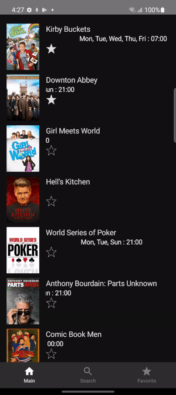

# TVMaze App

# Preview:

       
<!--  -->

## Introduction ##
This project is an Android app wich consumes the , to display, list, and provide information about the tv shows. This project is made in Kotlin and Android Compose, and inspired in the concept of clean architecture as it shown in the following diagram to create the project structure.

## Technologies used ##

This application uses the most common libraries for Android projects:

- Compose: It is used as the main library to render UI elements, based on composition of UI components approach.
- Hilt: Is the framework used to manage the dependency injection.
- Retrofit: It allows to define the proper operations to consume the the methods provided by the Breaking Bad Api.
- Moshi: It is used to map the json retrieved by the server to data classes.
- Timber: This library provide improvement for log messages with the context related when they are shown in Logcat.

## Pending Changes
- Persist data with Room.
- Allow user to store favorites shows.

## Author ##
Alejandro Daniel Jóse Gómez Flórez (@aldajo92)
